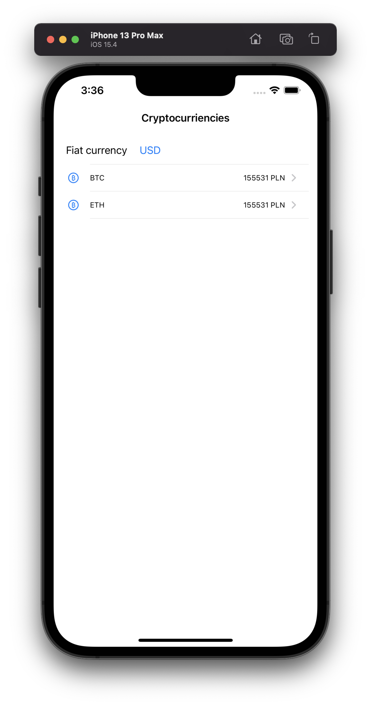
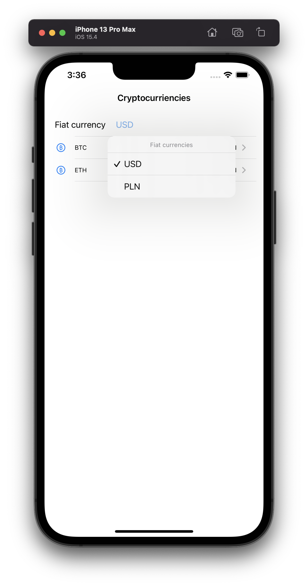
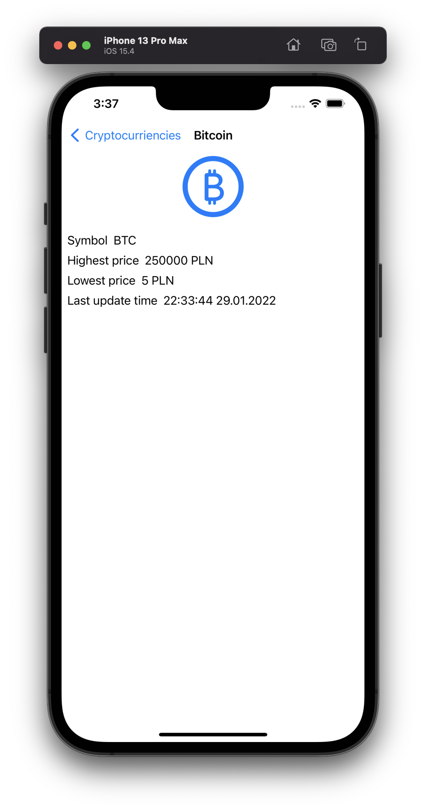

#  Currency homework

## Description
Create a iOS application which shows info of the most important cryptocurrencies in table view. Additionally,
it downloads list of fiat currencies so that user can select in which fiat currency he want's to see crypto price.
For each cryptocurrency in the list you have to show the corresponding image, the name and the current price (in fiat currency that user selected)
Clicking on the item of the list should present more info in details view controller like:
- Symbol (e.g. eth)
- Image
- Highest price in latest 24h
- Lowest price in latest 24h
- Last update time
- Crypto currency name in tile

Data need to be automatically refreshed with a rate of 10 seconds.
Cryptocurrency price should be downloaded automatically after user changes fiat currency

## Requirements
* Don't use any of external frameworks, just the ones available in iOS 15 (so don't use RxSwift or ReactiveSwift or SnapKit or anything like that)
* You can use GCD, NSOperationQueue, Combine, Swift's Async/Await or even NSThread - anything what you prefer or feel it will be fastest
* No local caching is needed
* Feel free to use either UIKit or SwiftUI. Storyboard or XIB or code - all is fine
* We don't expect to see all code unit tested, just please make sure your code entites are potentially testable.
* Don't wait to present all data until you download cryptocurriencies images.
* If user selects fiat currency that's not supported in cryptocurrency conversion display an error label instead of whole table. This happens in case of -> `{"error":"invalid vs_currency"}`
* no need to literally stick to given layouts or existing code structure
* If using UIKit:
    - to build UITableView we encourage to use UIDiffableDataSource
    - on the details view please use UIStackView's composition

## Tasks summary
1. Download all fiat currencies
2. Download cryptocurrencies with price in fiat currency selected by user
3. Build table layout with fiat currency selector above
4. Build cryptocurrency detail layout using UIStackView (in case of using UIKit)

## Layouts
Main view: 

## Delivery
Please put your solution into public Github/Gitlab/Bitbucket repository

## Note
The project does not necessary have been complete. Whatever is missing can be just be discussed or implemented together
